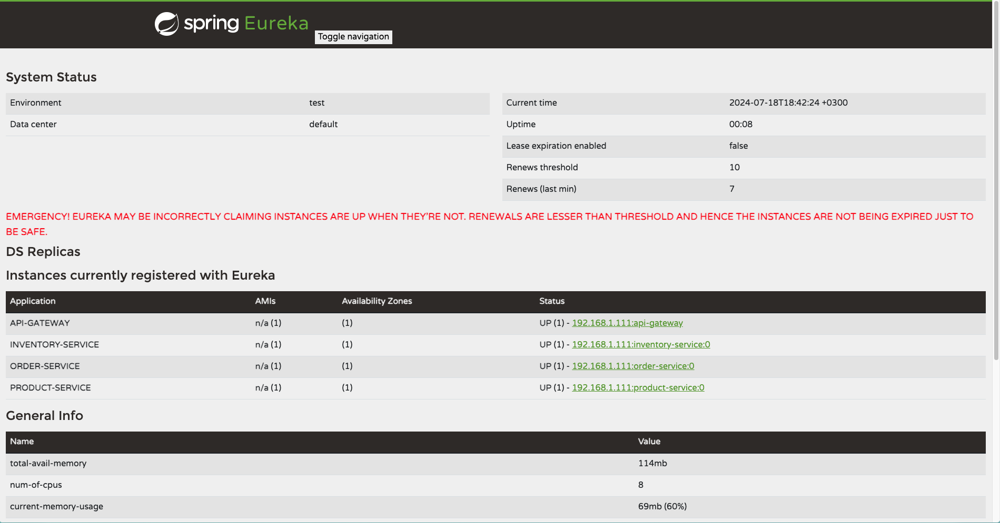

# E-Commerce Microservices API

Bu proje Spring Boot ile geliştirilmiştir ve e-ticaret platformları için mikroservis mimarisi kullanılarak geliştirilmiş bir API örneğidir. Proje aşağıdaki servislerden oluşmaktadır:

- **InventoryService**: Ürün envanterini yönetir.
- **OrderService**: Siparişleri yönetir.
- **NotificationService**: Kullanıcılara bildirimler gönderir.
- **ProductService**: Ürünleri yönetir.
- **Discovery**: Eureka servis keşfi sağlar.
- **API Gateway**: Tüm servislere merkezi erişim noktası sağlar.

## Spring Eureka Görüntüsü



## Servislerin Tanıtımı

### InventoryService

Ürün envanterini yönetmek için kullanılır.

#### Özellikler

- Stok durumu kontrolü yapar.

#### Örnek API Çağrısı

```http
GET /api/inventory
```

### OrderService
Sipariş işlemlerini yönetir.

#### Özellikler
- Sipariş oluşturur.

#### Örnek API Çağrısı
```http request
POST /api/order
```

### ProductService
#### Ürün bilgilerini yönetir.

#### Özellikler
- Ürün ekler.
- Ürün bilgilerini görüntüler.

```http request
GET /api/product
```

### Discovery
Eureka kullanarak servis keşfi sağlar. Tüm mikro servislerin birbirlerini bulmasını ve iletişim kurmasını sağlar.

#### Özellikler
- Servis kaydı ve keşfi.
- Dinamik yük dengeleme.

### API Gateway
Tüm servislere merkezi erişim noktası sağlar. İstekleri ilgili mikro servislere yönlendirir.

#### Özellikler
- Merkezi kimlik doğrulama.
- Yük dengeleme.
- API yönlendirme.

### Kurulum
#### Gereksinimler
- JDK 17
- Docker

### Kurulum Adımları
1. Projeyi klonlayın:
``` http request
git clone https://github.com/your-username/ecommerce-microservices-api.git
cd ecommerce-microservices-api
```
2. Docker Compose ile servisleri başlatın:

```http request
docker-compose -f docker-compose.yml up -d
```
3. Eureka Dashboard'a erişin:
```http request
http://localhost:8761
```

4. API Gateway üzerinden servislere erişin:
```http request
http://localhost:8080
```

### Katkıda Bulunma
#### Bu projeye katkıda bulunmak için, lütfen bir pull request açın veya bir issue oluşturun.